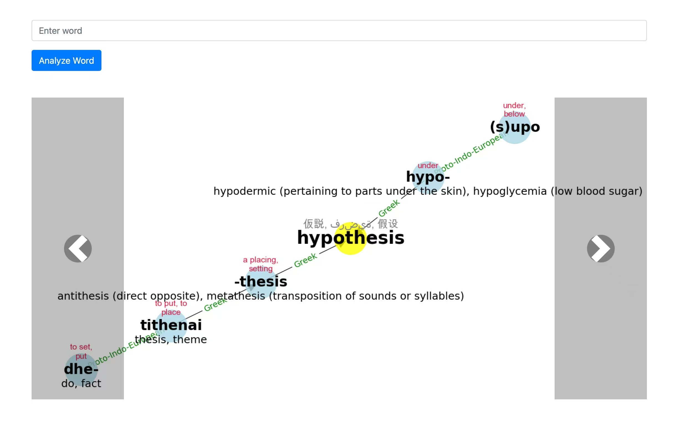
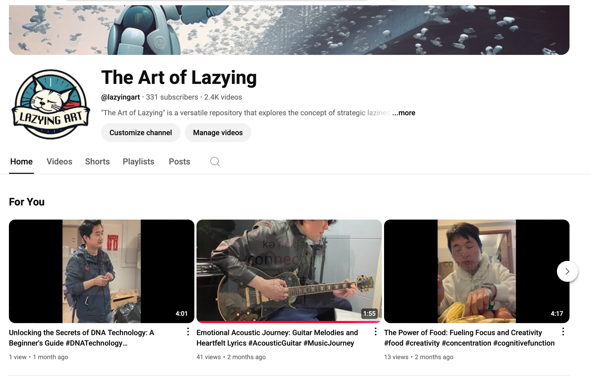

# The Art of Lazying

A repository that promotes strategic laziness for a simplified, productive life, encompassing AI agents, language learning, and vlogs with practical tips and real-life use cases.


## Projects

### 🤖 AI-Powered Creative Tools

| Project | Description | Demo |
|---------|-------------|------|
| [EinkWordsGPT](https://github.com/lachlanchen/the-art-of-lazying/tree/main/code/EinkWordsGPT) | E-ink display with GPT-powered word learning |  |
| [WordsOrigin](https://github.com/lachlanchen/WordOrigins) | Words origin analysis and presenting in graph. |  |
| [LazyLanguageLearner](https://github.com/lachlanchen/lazylanguagelearner) | Tools for efficient language learning with minimal effort | |WW
| [VideoCaptionerWithClip](https://github.com/lachlanchen/VideoCaptionerWithClip) | Video & image captioning with OpenAI CLIP embeddings + GPT decoder |  |
| [VideoCaptionerWithVit](https://github.com/lachlanchen/VideoCaptionerWithVit) | Video captioning tool: extract key‑frames with Katna/OpenCV & generate captions with a ViT+GPT‑2 model | |
| [AutoTranscription - MultilingualWhisper](https://github.com/lachlanchen/MultilingualWhisper) | Multilingual transcription pipeline with fine‑grained language detection |  |
| **AutoTranslation** (Code in preparation) | Breaking language barriers for global creative exchange |  |
| [LazyEdit](https://github.com/lachlanchen/LazyEdit) | AI-powered automatic video editing tool with transcription, auto-subtitle, highlighting, and metadata generation |  |
| [AutoPublication](https://github.com/lachlanchen/AutoPublication) | Streamlining content publishing workflows |  |
| [AutoPubMonitor](https://github.com/lachlanchen/AutoPubMonitor) | Automated system for monitoring, processing, and publishing video content to multiple platforms |  |
| [Grilling ChatGPT](https://github.com/lachlanchen/grilling_chatgpt) | Advanced techniques for effectively using AI assistants | |

### 🔄 Automation Tools


## Folder Structure

```
the-art-of-lazying/
│
├───code/
│ ├───ai-agents/
│ ├───automation/
│ └───language-learning/
│
├───book/
│ ├───manuscript/
│ └───resources/
│
├───examples/
│ ├───practical-tips/
│ ├───use-cases/
│ └───community-contributions/
│
└───vlogs/
  ├───language-learning/
  └───lazy-lifestyle/
```

## Table of Contents

- [Projects](#projects)
- [Folder Structure](#folder-structure)
- [Introduction](#introduction)
- [The Theory of Lazying](#the-theory-of-lazying)
- [Practical Tips and Tricks](#practical-tips-and-tricks)
- [Use Cases](#use-cases)
- [AI Agents and Automation](#ai-agents-and-automation)
- [Language Learning and Vlogs](#language-learning-and-vlogs)
- [Community Contributions](#community-contributions)

## Introduction

The Art of Lazying presents strategic laziness as a way to optimize energy use and focus on what truly matters. This repository explores how intentional laziness can lead to higher productivity, creativity, and well-being.

## The Theory of Lazying

A comprehensive introduction to the principles of strategic laziness, focusing on how to maximize productivity and well-being by prioritizing, delegating, and automating tasks.

The key principle is applying Pareto's 80/20 rule to daily life - identifying the 20% of activities that produce 80% of desired outcomes.

## Practical Tips and Tricks

A collection of actionable advice on applying lazy principles to work, relationships, and self-care:
- Automating repetitive tasks
- Using the Pomodoro Technique for time management
- Creating systems that reduce decision fatigue
- Leveraging AI tools for assistance

## Use Cases

Real-life examples demonstrating how lazying principles solve problems and improve efficiency:
- How entrepreneurs use delegation and automation to focus on business growth
- How academics streamline research workflows
- How content creators optimize their production process

## AI Agents and Automation

Explore the development of AI agents and automation tools that simplify tasks:
- Using ChatGPT as a personal assistant
- Building custom automation workflows
- Creating e-ink displays for passive learning

## Language Learning and Vlogs

Resources and techniques for efficient language learning, plus vlogs documenting the lazying journey:
- Creating personalized language learning with spaced repetition
- Implementing immersive learning techniques
- Building projects that encourage passive learning

## Community Contributions

Share your own experiences, tips, and ideas on strategic laziness:
- Forum for exchanging productivity hacks
- Tools and templates for daily routines
- Collaborative projects for lazy efficiency

## Connect

- Website: [lazying.art](https://lazying.art)
- GitHub: [lachlanchen](https://github.com/lachlanchen)
- Email: lach@lazying.art
