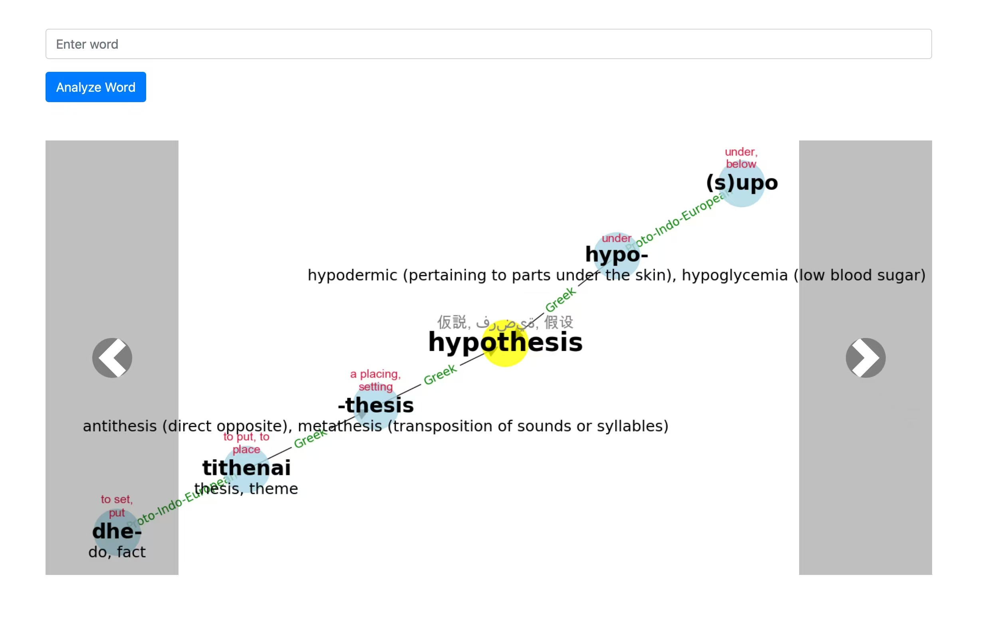
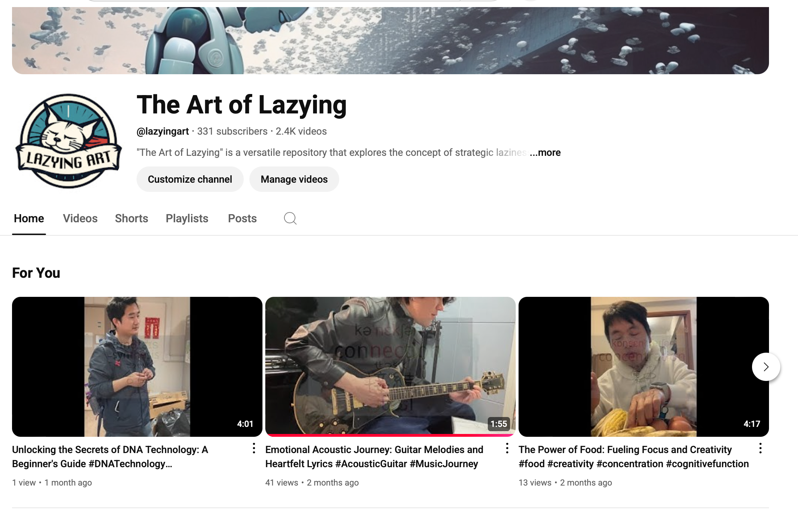

[English](README.md) · [العربية](i18n/README.ar.md) · [Español](i18n/README.es.md) · [Français](i18n/README.fr.md) · [日本語](i18n/README.ja.md) · [한국어](i18n/README.ko.md) · [Tiếng Việt](i18n/README.vi.md) · [中文 (简体)](i18n/README.zh-Hans.md) · [中文（繁體）](i18n/README.zh-Hant.md) · [Deutsch](i18n/README.de.md) · [Русский](i18n/README.ru.md)


[](https://github.com/lachlanchen/lachlanchen/blob/main/figs/banner.png)

# The Art of Lazying

[](LICENSE)
[](https://github.com/sponsors/lachlanchen)
[](https://lazying.art)


[](https://github.com/lachlanchen/the-art-of-lazying/stargazers)
[](https://github.com/lachlanchen/the-art-of-lazying/network/members)
[](https://github.com/lachlanchen/the-art-of-lazying/commits/main)

A repository focused on strategic laziness for a simpler, higher-leverage life, covering AI agents, language learning, practical automation, and vlog-driven real-world workflows.

| Focus | What this README contains |
|---|---|
| 🤖 Automation | Core tools, scripts, and practical workflows you can run locally |
| 🧠 Learning | Language-first projects and examples for efficient study habits |
| 📚 Sharing | Multilingual docs, project links, and contribution guidance |


## Table of Contents

- [Overview](#overview)
- [Projects](#projects)
- [Repository Structure](#repository-structure)
- [Features](#features)
- [Prerequisites](#prerequisites)
- [Installation](#installation)
- [Usage](#usage)
- [Configuration](#configuration)
- [Examples](#examples)
- [Development Notes](#development-notes)
- [Troubleshooting](#troubleshooting)
- [Roadmap](#roadmap)
- [Introduction](#introduction)
- [The Theory of Lazying](#the-theory-of-lazying)
- [Practical Tips and Tricks](#practical-tips-and-tricks)
- [Use Cases](#use-cases)
- [AI Agents and Automation](#ai-agents-and-automation)
- [Language Learning and Vlogs](#language-learning-and-vlogs)
- [Community Contributions](#community-contributions)
- [❤️ Support](#-support)
- [Connect](#connect)
- [Contributing](#contributing)
- [License](#license)

## Overview

`the-art-of-lazying` is a hub repository for practical strategic laziness: automate repetitive work, improve language-learning workflows, and document real-world experiments through scripts and vlogs.

| At a Glance | Details |
|---|---|
| 🎯 Core theme | Strategic laziness for productivity, learning, and creative output |
| 🧩 Repository style | Hybrid of local tools + curated external projects |
| 🛠️ Local highlights | `code/EinkWordsGPT`, `scripts/lazy-care/SafeShell`, `lazy-hacks/codex-cli`, `vlogs/chatgpt-traffic`, `vlogs/repo2text` |
| 🌍 Documentation | Root README + multilingual `i18n/` variants |

This repo contains both:
- Curated links to related external projects.
- Local tools and code, especially:
  - `code/EinkWordsGPT` (Raspberry Pi + Waveshare e-ink + OpenAI word-learning display).
  - `scripts/lazy-care/SafeShell` (safe delete/restore shell functions).
  - `vlogs/chatgpt-traffic` and `vlogs/repo2text` (small Python utilities).

## Projects

### 🚀 AI-Powered Creative Tools

| Project | Description | Demo |
|---------|-------------|------|
| [EinkWordsGPT](https://github.com/lachlanchen/the-art-of-lazying/tree/main/code/EinkWordsGPT) | E-ink display with GPT-powered word learning |  |
| [WordsOrigin](https://github.com/lachlanchen/WordOrigins) | Words origin analysis and presenting in graph. |  |
| [LazyLanguageLearner](https://github.com/lachlanchen/lazylanguagelearner) | Tools for efficient language learning with minimal effort | |
| [VideoCaptionerWithClip](https://github.com/lachlanchen/VideoCaptionerWithClip) | Video & image captioning with OpenAI CLIP embeddings + GPT decoder |  |
| [VideoCaptionerWithVit](https://github.com/lachlanchen/VideoCaptionerWithVit) | Video captioning tool: extract key-frames with Katna/OpenCV & generate captions with a ViT+GPT-2 model | |
| [AutoTranscription - MultilingualWhisper](https://github.com/lachlanchen/MultilingualWhisper) | Multilingual transcription pipeline with fine-grained language detection |  |
| [**AutoTranslation**](https://github.com/lachlanchen/LazyEdit/blob/master/lazyedit/subtitle_translate.py) | Breaking language barriers for global creative exchange |  |
| [**AutoMeta**](https://github.com/lachlanchen/LazyEdit/blob/master/lazyedit/subtitle_metadata.py) | Automatic metadata generation for videos | |
| [LazyEdit](https://github.com/lachlanchen/LazyEdit) | AI-powered automatic video editing tool with transcription, auto-subtitle, highlighting, and metadata generation | |
| [AutoPublication](https://github.com/lachlanchen/AutoPublication) | Streamlining content publishing workflows |  |
| [AutoPubMonitor](https://github.com/lachlanchen/AutoPubMonitor) | Automated system for monitoring, processing, and publishing video content to multiple platforms | |
| [Grilling ChatGPT](https://github.com/lachlanchen/grilling_chatgpt) | Advanced techniques for effectively using AI assistants | |

### ⚙️ Automation Tools (Local in This Repository)

- `scripts/lazy-care/SafeShell/safeshell_functions.sh`: safer shell deletion (`saferm`), restore (`unrm`), and explicit permanent deletion (`removeitanyway`).
- `lazy-hacks/codex-cli/`: practical Codex CLI operational hacks (`codex`, `codexr`, `codexmv`) for stable resume workflows after path changes.
- `lazy-hacks/android-file-transfer-reconnect-macos.md`: quick macOS recovery steps when Android File Transfer gets stuck after a bad disconnect.
- `vlogs/chatgpt-traffic/chatgpt-traffic.py`: domain-to-IP resolver and deduplicated output generator.
- `vlogs/repo2text/convert-repo-to-merged-text.py`: merges Python files by directory into text bundles for AI-assisted analysis.

## Repository Structure

```text
the-art-of-lazying/
├── README.md
├── README_EN.md
├── README_CN.md
├── LICENSE
├── .github/
│   └── FUNDING.yml
├── i18n/
│   ├── README.ar.md
│   ├── README.es.md
│   ├── README.fr.md
│   ├── README.ja.md
│   ├── README.ko.md
│   ├── README.vi.md
│   ├── README.zh-Hans.md
│   └── README.zh-Hant.md
├── code/
│   └── EinkWordsGPT/
│       ├── README.md
│       ├── README_CN.md
│       ├── words_gpt.py
│       ├── words_data.py
│       ├── words_update.py
│       ├── epd_7in3f_test.py
│       ├── words_phonetics.db
│       ├── data/
│       ├── font/
│       └── pic/
├── scripts/
│   └── lazy-care/
│       ├── README.md
│       └── SafeShell/
│           ├── README.md
│           └── safeshell_functions.sh
├── lazy-hacks/
│   ├── README.md
│   ├── android-file-transfer-reconnect-macos.md
│   └── codex-cli/
│       ├── README.md
│       ├── codex-and-codexr.md
│       ├── codexmv-macos-zsh.md
│       └── codexmv-session-migration.md
├── examples/
│   └── lazy-learning/BuildChachaGPTWithChatGPT/
├── books/
├── demos/
├── figs/
└── vlogs/
    ├── chatgpt-traffic/
    ├── repo2text/
    └── google-framework/
```

Note: Older generic folder diagrams in prior README variants referenced abstract paths (for example `book/`, `code/ai-agents/`) that do not exactly match the current repository tree. The structure above reflects current files.

## Features

- Strategic laziness framework for productivity, learning, and content workflows.
- Curated AI project portfolio spanning transcription, captioning, translation, and publication automation.
- Hardware-integrated language learning with GPT-assisted word selection (`EinkWordsGPT`).
- Practical shell safety tooling for reversible deletion workflows.
- Script-first utilities for DNS/domain traffic checks and repository-to-text conversion.
- Multilingual documentation support via `i18n/`.

## Prerequisites

General:
- Git
- Python 3.9+ recommended

For `code/EinkWordsGPT`:
- Raspberry Pi (project docs mention Raspberry Pi 5)
- Waveshare 7.3-inch 7-color e-ink display with Python driver support (`waveshare_epd`)
- Python packages used in code: `openai`, `Pillow`, `pytz`, `pykakasi`
- SQLite (Python stdlib `sqlite3` is used)
- OpenAI API key configured in environment (the code initializes `OpenAI()` directly)

For `vlogs/chatgpt-traffic`:
- `dnspython`

For `scripts/lazy-care/SafeShell`:
- Bash or Zsh shell with access to `realpath`, `mv`, and `/bin/rm`

## Installation

Clone the repository:

```bash

git clone https://github.com/lachlanchen/the-art-of-lazying.git
cd the-art-of-lazying
```

Install commonly used Python dependencies (repository-wide baseline):

```bash
pip install openai Pillow pytz pykakasi dnspython
```

Note: `code/EinkWordsGPT/README.md` mentions `requirements.txt`, but no `requirements.txt` is currently present in this repository. Install packages manually as above.

## Usage

### 1) EinkWordsGPT (local hardware flow)

```bash
cd code/EinkWordsGPT
python epd_7in3f_test.py   # optional hardware/display test
python words_gpt.py        # run the display loop (refreshes approximately every 300s)
```

Optional database maintenance script:

```bash
cd code/EinkWordsGPT
python words_update.py
```

### 2) SafeShell (safer delete workflow)

Load shell functions:

```bash
source "$HOME/ProjectsLFS/the-art-of-lazying/scripts/lazy-care/SafeShell/safeshell_functions.sh"
```

Use commands:

```bash
rm -rf ./generated-build
unrm ./generated-build
removeitanyway -rf ./generated-build
```

SafeShell is Bash-specific. For persistent setup, source its file once from
`~/.bashrc`; do not repeatedly append the file contents. See the
[complete SafeShell guide](scripts/lazy-care/SafeShell/README.md).

### 3) ChatGPT Traffic resolver

```bash
cd vlogs/chatgpt-traffic
python chatgpt-traffic.py
```

### 4) Repo-to-text merger

```bash
cd vlogs/repo2text
python convert-repo-to-merged-text.py
```

Note: `convert-repo-to-merged-text.py` currently uses hardcoded paths (`source_directory = 'diffraction'`, `target_directory = 'merged_py_files'`). Edit those constants before running against another repo.

## Configuration

### OpenAI configuration (`code/EinkWordsGPT`)

The code creates the client with:

```python
client = OpenAI()
```

So configure your API credentials using the standard OpenAI environment variable approach before running scripts.

### Database path (`code/EinkWordsGPT`)

Default in code:

```python
db_path = 'words_phonetics.db'
```

Ensure `words_phonetics.db` exists in `code/EinkWordsGPT/` (it is currently included in this repository).

### SafeShell trash location

`saferm`/`unrm`/`removeitanyway` use this workstation default:

```bash
/mnt/disk/BIN/ROOT
```

The default fails closed unless `/mnt/disk` is mounted. For another machine,
set `SAFERM_TRASH_ROOT` before sourcing the script instead of editing it.

## Examples

- E-ink word card demos in `demos/`:
  - `demos/words_card_arabic.JPG`
  - `demos/words_origin.jpg`
  - `demos/autocaption.PNG`
  - `demos/autotranscription.PNG`
  - `demos/autotranslation.JPG`
  - `demos/autopublication.png`
- Build notes/materials for ChachaGPT:
  - `examples/lazy-learning/BuildChachaGPTWithChatGPT/plain_transformer.ipynb`
  - `examples/lazy-learning/BuildChachaGPTWithChatGPT/Prompts of ChachaGPT.pdf`

## Development Notes

- This is a multi-project showcase repo with both local code and external project links.
- No root-level package manager or build manifest is currently provided (`pyproject.toml`, `package.json`, `requirements.txt`, `Makefile` are not present at root).
- Several sub-readmes are template-like and can be partially stale versus current file layout; commands in this README are aligned with currently existing paths/scripts.
- `README_EN.md` and `README_CN.md` exist as legacy variants; `README.md` + `i18n/*` is the active multilingual structure.

## Troubleshooting

- `ModuleNotFoundError` for Python packages:
  - Reinstall dependencies with `pip install openai Pillow pytz pykakasi dnspython`.

- `ImportError: waveshare_epd` in `EinkWordsGPT`:
  - Install Waveshare e-paper Python driver/library on your Raspberry Pi environment.

- OpenAI authentication errors:
  - Verify your OpenAI API key is set in environment variables before running `words_gpt.py` or `words_update.py`.

- `saferm`/`unrm` not found after setup:
  - Confirm Bash sourced `safeshell_functions.sh` directly or through `~/.bashrc`.

- `unrm` cannot restore files:
  - Run `unrm --list PATH`; use an original absolute/relative path, a direct
    `/mnt/disk/BIN/ROOT/...` path, or `unrm --newest PATH` for repeated versions.

- `repo2text` script creates no output:
  - Update `source_directory` in `convert-repo-to-merged-text.py` to an existing folder.

## Roadmap

- Expand root README parity across all i18n files (currently summaries in many languages).
- Add environment-specific setup docs for Waveshare e-ink drivers.
- Add root-level reproducible dependency manifests for local tools.
- Add validation/testing scripts for critical utilities.
- Continue consolidating external project links with richer local demos.

## Introduction

The Art of Lazying presents strategic laziness as a way to optimize energy use and focus on what truly matters. This repository explores how intentional laziness can lead to higher productivity, creativity, and well-being.

## The Theory of Lazying

A comprehensive introduction to the principles of strategic laziness, focusing on how to maximize productivity and well-being by prioritizing, delegating, and automating tasks.

The key principle is applying Pareto's 80/20 rule to daily life: identifying the 20% of activities that produce 80% of desired outcomes.

## Practical Tips and Tricks

A collection of actionable advice on applying lazy principles to work, relationships, and self-care:
- Automating repetitive tasks
- Using the Pomodoro Technique for time management
- Creating systems that reduce decision fatigue
- Leveraging AI tools for assistance

## Use Cases

Real-life examples demonstrating how lazying principles solve problems and improve efficiency:
- How entrepreneurs use delegation and automation to focus on business growth
- How academics streamline research workflows
- How content creators optimize their production process

## AI Agents and Automation

Explore the development of AI agents and automation tools that simplify tasks:
- Using ChatGPT as a personal assistant
- Building custom automation workflows
- Creating e-ink displays for passive learning

## Language Learning and Vlogs

Resources and techniques for efficient language learning, plus vlogs documenting the lazying journey:
- Creating personalized language learning with spaced repetition
- Implementing immersive learning techniques
- Building projects that encourage passive learning

## Community Contributions

Share your own experiences, tips, and ideas on strategic laziness:
- Forum for exchanging productivity hacks
- Tools and templates for daily routines
- Collaborative projects for lazy efficiency

## Connect

- Website: [lazying.art](https://lazying.art)
- GitHub: [lachlanchen](https://github.com/lachlanchen)
- Email: lach@lazying.art

## Contributing

Contributions are welcome across code, docs, examples, and translations.

1. Fork the repository.
2. Create a branch (`git checkout -b feature/your-feature`).
3. Make changes with clear commit messages.
4. Open a Pull Request describing motivation and impact.

If you are unsure where to start:
- Improve setup docs for a local tool.
- Add tests or validation scripts for existing utilities.
- Improve parity/quality for one `i18n/README.*.md` variant.

## ❤️ Support

| Donate | PayPal | Stripe |
| --- | --- | --- |
| [](https://chat.lazying.art/donate) | [](https://paypal.me/RongzhouChen) | [](https://buy.stripe.com/aFadR8gIaflgfQV6T4fw400) |

## License

This repository includes GPLv3 license text at the root (`LICENSE`) and in several subfolders.

Note: Some subproject READMEs mention MIT. Until each subproject is clarified, treat the root repository as GPLv3-governed and verify per subproject if you plan to redistribute code independently.
